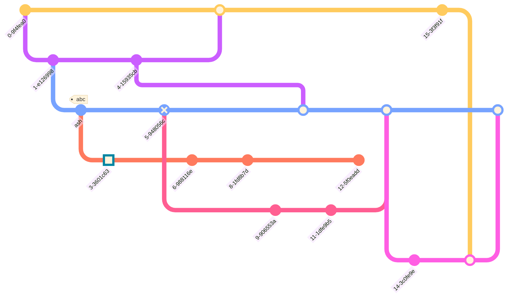

# Plugins
## DH-Mac
- Ink
- Slash Commander
- [Zotero Integration](obsidian://show-plugin?id=obsidian-zotero-desktop-connector)
- Pandoc
- Pandoc Reference List

## Laptop
- Code Styler
- Ink
- Slash Commander
- Webpage HTML Export

## Mobile
- Git
- Ink


# Mermaid
Eine Bibliothek die es erlaub Diagramme durch textuelle Beschreibungen zu erstellen und in Markdown einzufügen.

[Mermaid | Diagramming and charting tool](https://mermaid.js.org/)

Neben simplen Pie-Charts sind auch Klassen-/Sequenzdiagramme unterstützt


Auch seltenere Diagrammtypen wie `GitGraph` sind enthalten



# Committing on Mobile
## Cloning the Repo
### Android
Termux App installieren
Zugriff auf Dateisystem über:
``` Shell
termux-setup-storage
```
Durch CommandLine Repo Klonen, in Obsidian App das geklonte Verzeichnis auswählen.

## Git Plugin
Als Passwort wird ein PAT für das Repo verwendet.
Erstellung: 

## Directory
cd "/data/data/com.termux/files/home/storage/documents/Obsidian Vaults/Volcano"

## Git
Add, commit und Push durch Termux.