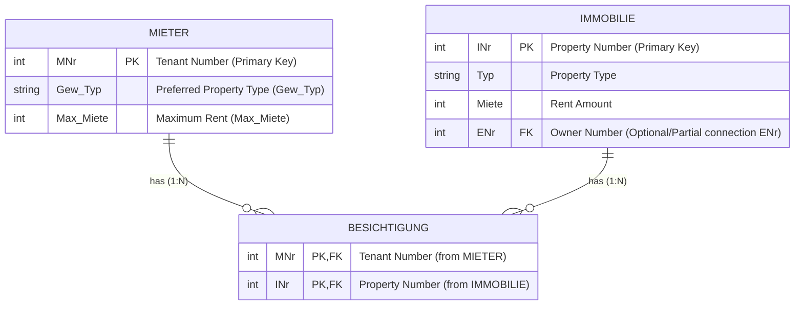

Die drei Varianten haben drastische Unterschiede in ihrer Performance. Bei Variante 1 wird aufgrund des JOIN mit großen Tabellen eine enorme Menge an Zwischenergebnissen generiert. 

In Variante 3 wird erst gefiltert bevor der JOIN stattfindet, so kann eine um mehrere Größenordnungen bessere Ausführung erreicht werden.

Das Optimieren von Anfragen ist also durchaus sinnvoll und lohnenswert.


Die Reihenfolge der Operationen lassen sich als Baum darstellen.
Für die folgende Abfrage werden zwei solcher Pfade gezeigt.

```SQL
SELECT M.Name, F.Name FROM Mitarbeiter M, Filiale F
	WHERE 
		M.F_Nr = F.F_Nr 
	AND
		M.Position = ‘Manager‘
	AND 
		F.Stadt = ‘Stuttgart’;
```


Besser ist die folgende Ablaufreihenfolge.


Dabei kann ein Ausführungsbaum anhand einiger Umformungsregeln modifiziert werden.

# Transformationsregeln
Sei
- $R, S$ und $T$ Relationen
- $R$ Attribute $\{A_1, \dots, A_n\}$
- $S$ Attribute $\{B_1, \dots, B_m\}$
- $p,q$ und $r$ Prädikate
- $L, L_1, L_2, M, M_1, M_2$ und $N$ Attributmengen

## Regel 1
Konjunktive Selektionsoperationen können in einzelne Selektionen umgewandelt werden (und umgekehrt)
$$
\sigma_{p \wedge q \wedge r}(R) = \sigma_p(\sigma_q(\sigma_r(R)))
$$
## Regel 2
Selektionsoperationen sind kommutativ
$$
\sigma_q(\sigma_r(R)) = \sigma_r(\sigma_q(R)) 
$$
## Regel 3
In einer Reihe von Projektionen wird nur die letzte berücksichtigt.
$$
\Pi_L(\Pi_M(\dots(\Pi_N(R)))) = \Pi_L(R)
$$
## Regel 4
Selektionen und Projektionen sind kommutativ
$$
\Pi_{A_1, \dots, A_m}(\sigma_p(R)) = \sigma_p(\Pi_{A_1, \dots, A_m}(R))
$$
## Regel 5
(Theta-)Verbund und kartesisches Produkt sind kommutativ
$$
R \bowtie_p S  = S \bowtie_p R
$$
$$
R \times S = S \times R
$$
## Regel 6
Selektion und (Theta-)Verbund  sind distributiv
Selektion und kartesisches Produkt sind distributiv
$$
\sigma_p(R \bowtie_r S) = (\sigma_p(R)) \bowtie_r S
$$
$$
\sigma_p(R \times S) = (\sigma_p(R)) \times S
$$
## Regel 7
Projektion und (Theta-)Verbund sind distributiv
Selektion und kartesisches Produkt sind distributiv

Wenn $L_1$ nur Attribute aus $R$ und $L_2$ nur Attribute aus $S$ umfasst, dann gilt:
$$
\Pi_{L_1 \cup L_2}(R \bowtie_r S) = (\Pi_{L_1}(R)) \bowtie_r (\Pi_{L_2}(S))
$$
Falls in der Verbundbedingung $r$ zusätzliche Attribute $M$ vorkommen die nicht in $L$ sind, ist eine zusätzliche Projektion notwendig. 
$M_1$ sind nur Attribute aus $R$ und $M_2$ nur solche aus $S$.
$$
\Pi_{L_1 \cup L_2}(R \bowtie_r S) = (\Pi_{L_1\cup M_1}(R)) \bowtie_r (\Pi_{L_2 \cup M_2}(S))
$$
## Regel 8
Vereinigung und Schnitt sind kommutativ
$$
R \cup S = S \cup R
$$
$$
R \cap S = S \cap R
$$
> [!NOTE] Differenzoperator
> Der Differenzoperator ist nicht kommutativ
## Regel 9
Selektion und Mengenoperationen sind distributiv
$$
\sigma_p(R\cap S) = \sigma_p(R) \cap \sigma_p(S)
$$
$$
\sigma_p(R\cup S) = \sigma_p(R) \cup \sigma_p(S)
$$
$$
\sigma_p(R- S) = \sigma_p(R) - \sigma_p(S)
$$
## Regel 10
Projektion und Vereinigung sind distributiv
$$
\Pi_L (R\cup S) = \Pi_L(S) \cup \Pi_L(R)
$$
## Regel 11
(Theta-)Verbund und kartesisches Produkt sind assoziativ
$$
(R \bowtie S) \bowtie T = R \bowtie (S \bowtie T)
$$
$$
(R \times S) \times T = R \times (S \times T)
$$
## Regel 12
Vereinigung und Schnitt sind assoziativ
$$
(R \cup S) \cup T = R \cup (S \cup T)
$$
$$
(R \cap S) \cap T = R \cap (S \cap T)
$$

> [!NOTE] Differenzoperator
> Der Differenzoperator ist nicht assoziativ
# Heuristische Optimierung
## Heuristik 1
Splitte mehrfache Verbunde/Kartesische Produkte Auf
Es entsteht eine Folge einfacherer Operationen

[Regel 11](#Regel%2011)
## Heuristik 2
Splitte Konjunktive Selektionen in Einzelselektionen
Erlaubt großen Freiheitsgrad bei der Wahl des Ausführungszeitpunkts von Selektionen
[Regel 1](#Regel%201)

## Heuristik 3
Führe Selektionen so früh wie möglich aus.
Reduziert Größe der Zwischenresultate
[Regel 2](#Regel%202), [Regel 4](#Regel%204), [Regel 6](#Regel%206) und [Regel 9](#Regel%209)

## Heuristik 4
Durch [Heuristik 3](#Heuristik%203) ist die Selektion stets direkt vor einem Produkt.
Kombiniere diese Selektion mit dem Produkt als Prädikatsverbindung.

Die Operation ist laut der [Definition des Verbunds](Relationenalgebra.md#Thetaverbund) möglich
$$
\sigma_{R.a \theta S.b}(R\times S) = R \bowtie_{R.a \theta S.b}S
$$

## Heuristik 5
Nutze Assoziativität der binären Operationen um restriktivere Operationen zuerst auszuführen

[Regel 11](#Regel%2011) und [Regel 12](#Regel%2012)

## Heuristik 6
Führe Projektionen so früh wie möglich aus.
Projektionen reduzieren das Volumen des Resultats und somit die Menge an Daten die in allen folgenden Schritten verarbeitet werden müssen.

## Heuristik 7
Berechne gemeinsame Ausdrücke nur einmal

Caching soll verwendet werden falls Ergebnisse wiederverwendet werden.

## Beispiel Heuristische Optimierung
Unter Anwendung der [Transformationsregeln](#Transformationsregeln) und [Heuristiken](#Heuristische%20Optimierung) soll eine SQL-Anfrage optimiert werden.

### Problemstellung
Gegeben ist eine Datenbank in der Mieter und Immobilien, sowie die Besichtigungen der Immobilien durch Mieter verwaltet werden.


Folgende Anfrage wird gestellt um Alle Wohnungen zu finden die Eigentümer Nummer 4711 gehören und von interessierten Mietern besichtigt wurden, bei denen Wohnungstyp und Mietpreis passend ist.

```SQL
SELECT I.Inr, I.Strasse
FROM Mieter M, Besichtigung B, Immobilie I
WHERE M.Gew_Typ = ‘Wohnung’ 
	AND M.MNr=B.MNr 
	AND B.INr=I.INr 
	AND M.Max_Miete >= I.Miete 
	AND M.Gew_Typ=I.Typ 
	AND I.ENr=4711;
```

Ohne jegliche Optimierung entsteht folgender Baum:


### Schrittweise Optimierung
Die Selektion wird gemäß [Regel 1](#Regel%201) aufgeteilt und nach [Heuristik 3](#Heuristik%203) möglichst früh ausgeführt.


Die Selektionen direkt nach einem Kreuzprodukt werden zu Verbunden, diese werden in ihrer Reihenfolge getauscht um den stärker selektierenden Verbund zuerst auszuführen. Dabei muss beachtet werden, ob alle benötigten Attribute an der gewünschten Stelle vorhanden sind.


Um die ‘Breite’ der Datensätze zu reduzieren wird die Menge der Attribute mit Projektionen auf die notwendigen reduziert.


Da die Mieter nur nach Immobilien des Typs ‘Wohnung’ suchen, kann der Typ der Immobilie auch auf diesen begrenzt werden. Es ist nicht nötig erst zum Ende die passenden Typen zu vergleichen.


> [!Example] Klausuraufgabe
> - Ausführungsbaum selber optimieren (Ganz oder Teilschritte)
>   Seite 8-31 bis 8-38
> - Vergleich mehrerer unterschiedlich optimierter Ausführungsbäume

Wenn die logischen Operationen angeordnet sind, kann noch deren technische Implementierung ausgewählt werden. 
Die Erstellung dieses idealen Ausführungsplans ist aber aufgrund der großen Menge an Aktionen unrealistisch.


# Kostenbasierte Optimierung
Ziel ist es, die Logischen Operationen auf physische Operatoren abzubilden.
Also zu bestimmen, welche der [Implementierungen](09%20Implementierung%20Relationaler%20Operatoren.md) im aktuellen Kontext am optimalsten ist.
Wesentlicher Faktor ist dabei die Anzahl der Plattenzugriffe, da sie sehr langsam sind.
Weil diese Kosten von den Kardinalitäten der beteiligten Relationen abhängt und [kein pauschal bester Algorithmus](09%20Implementierung%20Relationaler%20Operatoren.md#Vergleich%20der%20Verbundimplementierungen) bestimmt werden kann, sind [Statistiken](09%20Implementierung%20Relationaler%20Operatoren.md#Datenbankstatistiken) zu den Daten notwendig.

Das Ersetzen der logischen Operationen durch Physische Operationen führt zu einem Ausführungsplan (Auch Ausführungsstrategie oder Zugriffsplan)


## Pipelining
Auch 'Stream-Based-Processing' oder 'On-The-Fly-Processing' vermeidet das Speichern von Zwischenresultaten auf Platte.
Ohne Pipelining werden Resultatet vollständig berechnet und ggf. zwischengespeichert bevor der nächste Verarbeitungsschritt auf sie zugreift.

Mit Pipelining werden sie - falls möglich - direkt weiterverarbeitet.
Daten werden nicht auf Platte geschrieben, sondern nur in kleine Puffer der Folgeschritte gelagert.


### Iteratoren
Sind die kleinen Puffer zwischen Operanden des Pipelining. Ein Iterator stellt drei Methoden bereit:
- `Open` um ihn zu initialisieren und Speicherplatz zu allokieren
- `GetNext`  um auf den nächsten Wert im Puffer zuzugreifen
- `Close` Terminiert den Iterator wenn alle Werte abgearbeitet wurden.

Vorteil von Iteratoren ist, dass mehrere Operationen gleichzeitig aktiv sein können und sie Pipelining auf eine sehr natürliche Weise umsetzen.


Nicht alle Operationen können durch Pipelining umgesetzt werden.

- Sortierungen
- Duplikatseliminierung
- Aggregatoperationen
- Mengendifferenzen
- Manche Implementierungsarten von Join oder Union
Diese Operationen können manchmal nicht vermieden werden. Alle ihre Eingabedaten müssen berechnet und ggf. auf Platte geschrieben werden. Somit sind diese Operationen sehr teuer.

## Verbund-Reihenfolge
Gemäß [Regel 5](#Regel%205) und [Regel 11](#Regel%2011) können Verbundoperationen in beliebiger Reihenfolge ausgeführt werden.
Dabei ergeben sich bei $n$ Relationen $\dfrac{(2(n-1))!}{(n-1)!}$ mögliche Reihenfolgen.
- $n = 7 \to 665.280$
- $n=10 \to \; > 176 Mrd.$ 

Durch Pruning wird der Lösungsraum eingeschränkt, da es nicht möglich oder sinnvoll ist jede einzelne Kombination zu berücksichtigen. 


Die linearen Strukturen schränken die Anzahl an Möglichkeiten drastisch ein. Dabei darf bei einem Links/Rechtstiefen Baum nur jeweils eine Seite weiter verschachtelt sein. Die Andere Seite des Verbunds muss jeweils immer eine Basisrelation sein.

Da die komplette innere Relation bei einem Verbund verwendet wird, muss diese immer materialisiert werden.

> [!NOTE] Begriffe: Innere Relation & Materialisiert
> Beim Verbund
> $$
> A \bowtie B
> $$
> Ist $A$ die äußere Relation und $B$ die "innere Relation". Der Begriff stammt aus der Implementierung, besonders aus dem [Block Nested Loop-Verbund](09%20Implementierung%20Relationaler%20Operatoren.md#Block%20Nested%20Loop-Verbund)
>
> ---
> Eine Materialisierte Relation liegt als physische Tabelle auf der Platte gespeichert.
> Gegenteil ist eine dynamisch berechnete Sicht.

Linkstiefe Bäume sind daher besonders interessant, da die inneren Relationen stets Basisrelationen sind die materialisiert vorliegen.

#### Reduzierung des Suchraums
##### Join-Heuristik 1
Unäre Operationen werden 'on-the-fly' berechnet.
- Selektionen: Beim ersten Lesen der Relation
- Projektion: Beim Bilden von Resultaten aus anderen Operationen
Somit werden alle Operationen als Teil einer Verbundoperation ausgeführt.

##### Join-Heuristik 2
Kartesische Produkte werden nur gebildet, wenn die Anfrage selber auch ein kartesisches Produkt enthält.


#### Aufzählen Linkstiefer Bäume
1. Durchgang 1
	- Aufzählung aller Strategien für alle Basisrelationen
	- Partitioniere diese Strategien in Äquivalenzklassen basierend auf Attributen mit [Interessanter Sortierreihenfolge](#Interessante%20Reihenfolge)
	- Bilde weitere Äquivalenzklasse mit allen anderen Strategien
	- Wähle aus jeder ÄK. die beste Strategie
	- Für jede Basisrelation können alle Attribute verworfen werden, die nicht in abschließender Projektion oder in Verbundoperationen benötigt werden.
2. Durchgang 2
	- Generiere Alle Strategien für zwei Relationen mit allen Kandidaten aus Durchgang 1 als linker Relation
	- Entferne dabei Kartesische Produkte
	- Bestimme erneut günstigste Strategien pro Äquivalenzklasse
3. Durchgang k
	- Generiere Alle Strategien für $k$ Relationen mit allen Kandidaten aus Durchgang $k-1$ als linke Relation
	- Kartesische Produkte entfernen und beste Strategie pro Klasse bestimmen
4. Durchgang $n$
	 - Wiederhole Schritte
	 - Vergleiche die günstigsten Strategien aller Äquivalenzklassen
	 - Beste Strategie ist die Lösung
	
##### Interessante Reihenfolge
Ein Zwischenresultat $Z$ hat eine 'interessante Reihenfolge' wenn mindestens eine der folgenden Bedingungen erfüllt ist.
- Sortiert nach einem Attribut dass in `ORDER BY` vorkommt
- Sortiert nach einem Attribut dass in `GROUP BY` vorkommt
- Sortiert nach Attribut, das in nachfolgendem Verbund benötigt wird.

Falls $Z$ eine solche interessante Reihenfolge besitzt muss er beim Optimieren berücksichtigt werden.

Der [Finale Algorithmus](#Aufzählen%20Linkstiefer%20Bäume) berechnet Bottom-Up und berücksichtigt die [Restriktionen](#Reduzierung%20des%20Suchraums).
