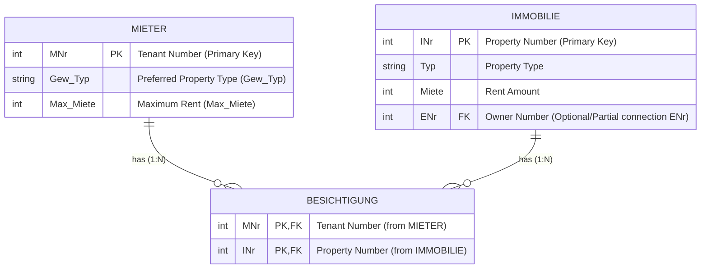

Die drei Varianten haben drastische Unterschiede in ihrer Performance. Bei Variante 1 wird aufgrund des JOIN mit großen Tabellen eine enorme Menge an Zwischenergebnissen generiert. 

In Variante 3 wird erst gefiltert bevor der JOIN stattfindet, so kann eine um mehrere Größenordnungen bessere Ausführung erreicht werden.

Das Optimieren von Anfragen ist also durchaus sinnvoll und lohnenswert.


Die Reihenfolge der Operationen lassen sich als Baum darstellen.
Für die folgende Abfrage werden zwei solcher Pfade gezeigt.

```SQL
SELECT M.Name, F.Name FROM Mitarbeiter M, Filiale F
	WHERE 
		M.F_Nr = F.F_Nr 
	AND
		M.Position = ‘Manager‘
	AND 
		F.Stadt = ‘Stuttgart’;
```


Besser ist die folgende Ablaufreihenfolge.


Dabei kann ein Ausführungsbaum anhand einiger Umformungsregeln modifiziert werden.

# Transformationsregeln
Sei
- $R, S$ und $T$ Relationen
- $R$ Attribute $\{A_1, \dots, A_n\}$
- $S$ Attribute $\{B_1, \dots, B_m\}$
- $p,q$ und $r$ Prädikate
- $L, L_1, L_2, M, M_1, M_2$ und $N$ Attributmengen

## Regel 1
Konjunktive Selektionsoperationen können in einzelne Selektionen umgewandelt werden (und umgekehrt)
$$
\sigma_{p \wedge q \wedge r}(R) = \sigma_p(\sigma_q(\sigma_r(R)))
$$
## Regel 2
Selektionsoperationen sind kommutativ
$$
\sigma_q(\sigma_r(R)) = \sigma_r(\sigma_q(R)) 
$$
## Regel 3
In einer Reihe von Projektionen wird nur die letzte berücksichtigt.
$$
\Pi_L(\Pi_M(\dots(\Pi_N(R)))) = \Pi_L(R)
$$
## Regel 4
Selektionen und Projektionen sind kommutativ
$$
\Pi_{A_1, \dots, A_m}(\sigma_p(R)) = \sigma_p(\Pi_{A_1, \dots, A_m}(R))
$$
## Regel 5
(Theta-)Verbund und kartesisches Produkt sind kommutativ
$$
R \bowtie_p S  = S \bowtie_p R
$$
$$
R \times S = S \times R
$$
## Regel 6
Selektion und (Theta-)Verbund  sind distributiv
Selektion und kartesisches Produkt sind distributiv
$$
\sigma_p(R \bowtie_r S) = (\sigma_p(R)) \bowtie_r S
$$
$$
\sigma_p(R \times S) = (\sigma_p(R)) \times S
$$
## Regel 7
Projektion und (Theta-)Verbund sind distributiv
Selektion und kartesisches Produkt sind distributiv

Wenn $L_1$ nur Attribute aus $R$ und $L_2$ nur Attribute aus $S$ umfasst, dann gilt:
$$
\Pi_{L_1 \cup L_2}(R \bowtie_r S) = (\Pi_{L_1}(R)) \bowtie_r (\Pi_{L_2}(S))
$$
Falls in der Verbundbedingung $r$ zusätzliche Attribute $M$ vorkommen die nicht in $L$ sind, ist eine zusätzliche Projektion notwendig. 
$M_1$ sind nur Attribute aus $R$ und $M_2$ nur solche aus $S$.
$$
\Pi_{L_1 \cup L_2}(R \bowtie_r S) = (\Pi_{L_1\cup M_1}(R)) \bowtie_r (\Pi_{L_2 \cup M_2}(S))
$$
## Regel 8
Vereinigung und Schnitt sind kommutativ
$$
R \cup S = S \cup R
$$
$$
R \cap S = S \cap R
$$
> [!NOTE] Differenzoperator
> Der Differenzoperator ist nicht kommutativ
## Regel 9
Selektion und Mengenoperationen sind distributiv
$$
\sigma_p(R\cap S) = \sigma_p(R) \cap \sigma_p(S)
$$
$$
\sigma_p(R\cup S) = \sigma_p(R) \cup \sigma_p(S)
$$
$$
\sigma_p(R- S) = \sigma_p(R) - \sigma_p(S)
$$
## Regel 10
Projektion und Vereinigung sind distributiv
$$
\Pi_L (R\cup S) = \Pi_L(S) \cup \Pi_L(R)
$$
## Regel 11
(Theta-)Verbund und kartesisches Produkt sind assoziativ
$$
(R \bowtie S) \bowtie T = R \bowtie (S \bowtie T)
$$
$$
(R \times S) \times T = R \times (S \times T)
$$
## Regel 12
Vereinigung und Schnitt sind assoziativ
$$
(R \cup S) \cup T = R \cup (S \cup T)
$$
$$
(R \cap S) \cap T = R \cap (S \cap T)
$$

> [!NOTE] Differenzoperator
> Der Differenzoperator ist nicht assoziativ
# Heuristische Optimierung
## Heuristik 1
Splitte mehrfache Verbunde/Kartesische Produkte Auf
Es entsteht eine Folge einfacherer Operationen

[Regel 11](#Regel%2011)
## Heuristik 2
Splitte Konjunktive Selektionen in Einzelselektionen
Erlaubt großen Freiheitsgrad bei der Wahl des Ausführungszeitpunkts von Selektionen
[Regel 1](#Regel%201)

## Heuristik 3
Führe Selektionen so früh wie möglich aus.
Reduziert Größe der Zwischenresultate
[Regel 2](#Regel%202), [Regel 4](#Regel%204), [Regel 6](#Regel%206) und [Regel 9](#Regel%209)

## Heuristik 4
Durch [Heuristik 3](#Heuristik%203) ist die Selektion stets direkt vor einem Produkt.
Kombiniere diese Selektion mit dem Produkt als Prädikatsverbindung.

Die Operation ist laut der [Definition des Verbunds](Relationenalgebra.md#Thetaverbund) möglich
$$
\sigma_{R.a \theta S.b}(R\times S) = R \bowtie_{R.a \theta S.b}S
$$

## Heuristik 5
Nutze Assoziativität der binären Operationen um restriktivere Operationen zuerst auszuführen

[Regel 11](#Regel%2011) und [Regel 12](#Regel%2012)

## Heuristik 6
Führe Projektionen so früh wie möglich aus.
Projektionen reduzieren das Volumen des Resultats und somit die Menge an Daten die in allen folgenden Schritten verarbeitet werden müssen.

## Heuristik 7
Berechne gemeinsame Ausdrücke nur einmal

Caching soll verwendet werden falls Ergebnisse wiederverwendet werden.

## Beispiel Heuristische Optimierung
Unter Anwendung der [Transformationsregeln](#Transformationsregeln) und [Heuristiken](#Heuristische%20Optimierung) soll eine SQL-Anfrage optimiert werden.

### Problemstellung
Gegeben ist eine Datenbank in der Mieter und Immobilien, sowie die Besichtigungen der Immobilien durch Mieter verwaltet werden.


Folgende Anfrage wird gestellt um Alle Wohnungen zu finden die Eigentümer Nummer 4711 gehören und von interessierten Mietern besichtigt wurden, bei denen Wohnungstyp und Mietpreis passend ist.

```SQL
SELECT I.Inr, I.Strasse
FROM Mieter M, Besichtigung B, Immobilie I
WHERE M.Gew_Typ = ‘Wohnung’ 
	AND M.MNr=B.MNr 
	AND B.INr=I.INr 
	AND M.Max_Miete >= I.Miete 
	AND M.Gew_Typ=I.Typ 
	AND I.ENr=4711;
```

Ohne jegliche Optimierung entsteht folgender Baum:


### Schrittweise Optimierung
Die Selektion wird gemäß [Regel 1](#Regel%201) aufgeteilt und nach [Heuristik 3](#Heuristik%203) möglichst früh ausgeführt.


Die Selektionen direkt nach einem Kreuzprodukt werden zu Verbunden, diese werden in ihrer Reihenfolge getauscht um den stärker selektierenden Verbund zuerst auszuführen. Dabei muss beachtet werden, ob alle benötigten Attribute an der gewünschten Stelle vorhanden sind.


Um die ‘Breite’ der Datensätze zu reduzieren wird die Menge der Attribute mit Projektionen auf die notwendigen reduziert.


Da die Mieter nur nach Immobilien des Typs ‘Wohnung’ suchen, kann der Typ der Immobilie auch auf diesen begrenzt werden. Es ist nicht nötig erst zum Ende die passenden Typen zu vergleichen.


> [!Example] Klausuraufgabe
> - Ausführungsbaum selber optimieren (Ganz oder Teilschritte)
>   Seite 8-31 bis 8-38
> - Vergleich mehrerer unterschiedlich optimierter Ausführungsbäume

Wenn die logischen Operationen angeordnet sind, kann noch deren technische Implementierung ausgewählt werden. 
Die Erstellung dieses idealen Ausführungsplans ist aber aufgrund der großen Menge an Aktionen unrealistisch.


Interessante Sortierreihenfolge:
Mindestens eine Bedingung erfüllt, nicht zwingend alle.

# Kostenbasierte Optimierung

> [!MISSING] TODO
> Ab 8-39
